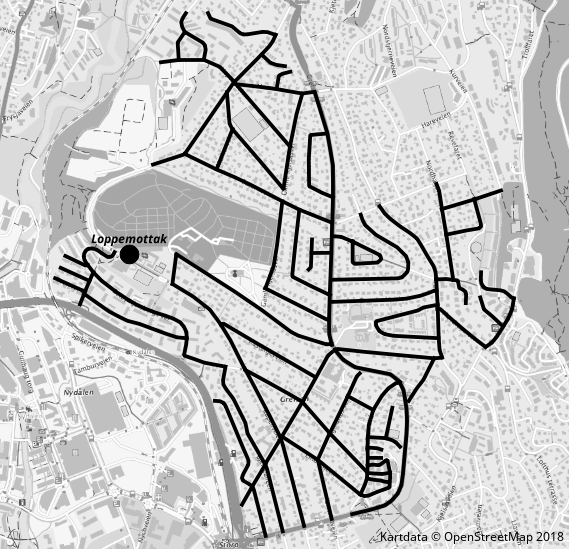

Kart over lopperuter Grefsen Skolekorps
=======================================

Her er grunnlagsdata for å lage kart over lopperuter for Grefsen
skolekorps, http://www.grefsenskolekorps.no/ .

Kartet har projesering WGS-84 UTM-32 N og er tegnet med QGis basert på
OpenStreetmap, med WMS-tjenesten tilgjengelig fra osm-wms.de som
bakgrunnskart.

Kartet er basert på rutekart brukt våren 2018 og endret for bruk høsten 2018.

Det lages to varianter av kartet.  Et for å dele ut i nærområdet.
Dette viser hvor det samles inn lopper.  Det lages for trykking i
sort-hvit og inneholder informasjon om hvilke veier det samles langs,
samt hvor en kan levere lopper.  For å lage dette kartet, slå av
kartlag 'lopperuter-områder' og 'grefsen-skolekrets-2018' samt endre
kartlagene 'lopperuter-veier' og 'OSM WMS - osm-wms.de' til gråtoner,
samt endre gjennomsiktigheten for 'lopperuter-veier' til 0%.

Den andre varianten brukes internt og viser hvilke veier og områder de
ulike lopperutene skal samle inn fra.  Det lages et oversiktskart og
individuelle kart pr. rute.

.. image:: lopperuter-fargekodet.png
